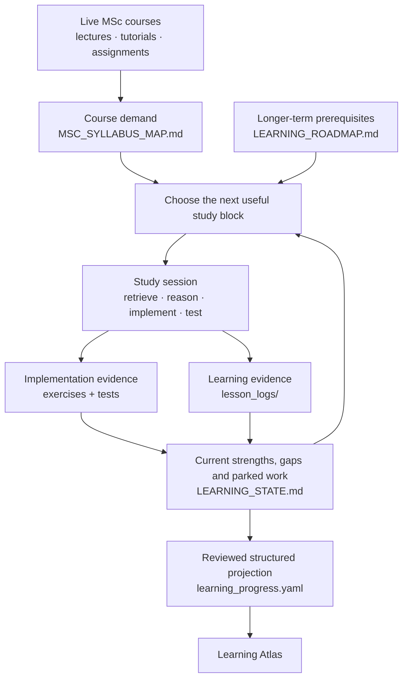

# MSc AI Learning Repository

This is my working learning repository for an MSc in Artificial Intelligence.

It started as a place to keep coding exercises, but it has gradually become a system for making study **cumulative**: code records what I have built, lesson logs preserve what I actually understood or found fragile, course folders track live lectures, and a small set of planning files helps decide what is worth studying next.

A big part of the experiment is using AI tutors without letting each new chat start from zero. The repository acts as durable external memory, while retrieval exercises and tests make sure that saved context does not get mistaken for actual learning.

## [Open the Learning Atlas](https://alistairkung.github.io/msc-ai-learning/)

The Learning Atlas is a read-only dashboard over the structured learning record. It shows current evidence, course runway and the active study lanes without pretending that progress can be reduced to a single mastery percentage.

## How the learning loop works



The loop is deliberately evidence-based. A passing test means some implementation works; it does not automatically mean I can reconstruct it cold. A topic appearing in lecture slides does not mean it was taught in depth. Something learned months ago is useful evidence of prior exposure, but may still need retrieval before I rely on it.

## What is in here

The code is organised by subject area: Python/data foundations, machine learning, classical AI/search, deep learning and agentic AI. Most numbered exercises have matching tests so there is a concrete record of what was implemented.

`lesson_logs/` is the durable learning history. Numbered preparation lessons and reconstructed historical foundations sit at its root. Live MSc material is grouped by course so lectures, tutorials, reflections and course context stay together:

```text
lesson_logs/
├── aims5701/          Fundamentals in Artificial Intelligence
├── aims5702/          Artificial Intelligence in Practice
├── aims5704/          Machine Learning Theory
├── ftec5660/          Agentic AI in Finance / FinTech
├── lessonNN_*.md      numbered cross-course preparation lessons
├── historical_*.md    reconstructed pre-repo maths/foundation learning
└── INDEX.md           coverage index
```

The rest of the repository contains the executable learning work:

```text
foundations/            Python, DSA, NumPy, pandas and maths foundations
machine_learning/       classical ML exercises
classical_ai/search/    BFS, DFS, UCS, A* and related practice
deep_learning/          tensors, autograd, training loops and MLPs
agentic_ai/             agentic-AI / LangChain implementation work
lesson_logs/            durable learning and course records
dashboard/              Learning Atlas builder and tests
```

## The documents that hold the system together

[`ARCHITECTURE.md`](ARCHITECTURE.md) explains **why the learning system is structured this way** and how evidence, state, course demand, strategy and the dashboard relate to one another.

[`SESSION_WORKFLOW.md`](SESSION_WORKFLOW.md) is the operating protocol for an AI tutor or model working with the repository. [`LEARNING_STATE.md`](LEARNING_STATE.md) is the short-lived handover: what is active, what is fragile, what is parked and what should happen next. [`MSC_SYLLABUS_MAP.md`](MSC_SYLLABUS_MAP.md) maps preparation against upcoming course material, while [`LEARNING_ROADMAP.md`](LEARNING_ROADMAP.md) holds the slower-changing prerequisite and dependency strategy.

`learning_progress.yaml` is the reviewed structured projection used by the dashboard. It is maintained from evidence rather than generated mechanically from Markdown or test results.

## How I use it to study

The normal tutoring loop is intentionally small:

```text
question or task
    → my attempt
    → concise feedback / hint
    → next task
```

Cold retrieval comes before explanation when that is useful. Important implementation work stays learner-owned rather than becoming copy/paste from a tutor. Changed examples are used to check transfer. Syntax slips, notation problems and conceptual gaps are recorded differently because they need different fixes.

The repository is also intentionally **lossy**. It is not meant to preserve every conversation. It keeps the bits that are useful later: what was learned, what needed help, what remains fragile, what evidence exists, and what should happen next.

## If you are an AI tutor/model

Start here rather than inferring the workflow from random files:

1. **First time in the repository:** read [`ARCHITECTURE.md`](ARCHITECTURE.md) to understand the system.
2. Read [`SESSION_WORKFLOW.md`](SESSION_WORKFLOW.md) for the tutoring and maintenance rules.
3. Read [`LEARNING_STATE.md`](LEARNING_STATE.md) for the current handover.
4. Check the relevant upcoming section of [`MSC_SYLLABUS_MAP.md`](MSC_SYLLABUS_MAP.md).
5. Load the **smallest relevant** lesson or course log. Live-course records are under `lesson_logs/<course_code>/`; numbered preparation logs remain at the root of `lesson_logs/`.
6. Inspect exercise/test code when implementation evidence matters. Use `LEARNING_ROADMAP.md` when a longer-term priority decision is needed, and `learning_progress.yaml` when changing the dashboard state.

Please preserve the evidence boundaries documented in the workflow: lecturer-covered material, pre-reading, guided work, independent performance, historical learning and personal synthesis are not interchangeable. A private local `LEARNER_PROFILE.md` may exist in the learner's own workspace; private profile content should never be copied into this public repository or dashboard.

## Running the repository

Run the full test suite with:

```bash
python -m pytest
```

To build the Learning Atlas locally:

```bash
python -m pytest dashboard/test_build.py
python dashboard/build.py
python -m http.server 8000 --directory dashboard/site
```

More dashboard maintenance details live in [`dashboard/README.md`](dashboard/README.md).

## Guiding idea

The point of all this is not to build elaborate study infrastructure for its own sake. It is to make learning easier to resume, harder to fake, and less dependent on one conversation remembering everything.